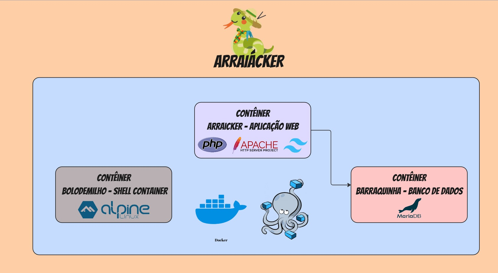

# 🎊 Arraiacker CTF - Capture The Flag do Arraiá! 🏆

<div align="center">
  
</div>

## 🐍 Sobre o Projeto

O **Arraiacker CTF** é um desafio de segurança cibernética temático de festa junina, desenvolvido com Docker para praticar conceitos de  containerização e segurança! Este projeto implementa um ambiente de CTF (Capture The Flag) completo com múltiplos containers, vulnerabilidades intencionais e flags escondidas.

<div align="center">
  
</div>

## 🏗️ Arquitetura do Sistema

O projeto é composto por **3 containers Docker** principais:

### 🗄️ Container 1: Banco de Dados (barraquinha)
- **Tecnologia**: MariaDB
- **Função**: Armazena dados dos usuários e informações do CTF
- **Vulnerabilidades**: SQL Injection, dados sensíveis
- **IP**: 172.20.0.5

### 🌐 Container 2: Aplicação Web (arraiacker)
- **Tecnologia**: PHP + Apache + TailwindCSS
- **Função**: Interface web principal do CTF
- **Vulnerabilidades**: Autenticação, autorização, XSS
- **Porta**: 8589
- **IP**: localhost(mas pode sre alterado)

### 🔐 Container 3: Servidor SSH (bolodemilho)
- **Tecnologia**: Linux + SSH
- **Função**: Desafio final do CTF
- **Vulnerabilidades**: Escalação de privilégios, arquivos sensíveis
- **Porta**: 2222
- **IP**: 172.20.0.15

## 🚀 Como Executar

### Pré-requisitos
- Docker
- Docker Compose

### Passos para Execução

1. **Clone o repositório:**
```bash
git clone <url-do-repositorio>
cd Arraiacker
```

2. **Execute o ambiente:**
```bash
docker-compose up -d
```

3. **Acesse a aplicação:**
- Aplicação Web: http://localhost:8589
- SSH do desafio final: `ssh -p 2222 usuario@localhost`

## 🎯 Objetivos do CTF

O desafio consiste em encontrar **4 flags** escondidas nos diferentes containers:

- **Flag 1**: Exploração da aplicação web
- **Flag 2**: SQL Injection no banco de dados
- **Flag 3**: Escalação de privilégios
- **Flag 4**: Acesso ao boss final via SSH

## 🛠️ Tecnologias Utilizadas

- **Docker & Docker Compose**: Containerização
- **PHP**: Backend da aplicação
- **MariaDB**: Banco de dados
- **Apache**: Servidor web
- **TailwindCSS**: Estilização
- **Linux**: Sistema operacional base
- **SSH**: Acesso remoto seguro

## 📁 Estrutura do Projeto

```
Arraiacker/
├── docker-compose.yaml          # Configuração dos containers
├── init.sql                     # Script de inicialização do banco
├── arraiacker/                  # Container da aplicação web
│   ├── Dockerfile
│   ├── public/                  # Arquivos públicos
│   ├── view/                    # Templates e páginas
│   └── config/                  # Configurações
├── bolodemilho/                 # Container SSH (boss final)
│   ├── Dockerfile
│   └── arquivos-secretos/       # Flags e desafios
└── database_data/               # Dados persistentes do banco
```

## 🔒 Vulnerabilidades Intencionais

⚠️ **ATENÇÃO**: Este projeto contém vulnerabilidades propositais para fins educacionais!

- SQL Injection
- Autenticação insegura
- Autorização inadequada
- Exposição de arquivos sensíveis
- Configurações inseguras


## 🏆 Créditos

Desenvolvido como projeto educacional para aplicar conceitos de:
- Containerização com Docker
- Segurança cibernética
- Desenvolvimento web
- Administração de sistemas

---

<div align="center">
  
  
**Que comece a diversão! 🎉**
  
  *Boa sorte, hackers do arraiá!* 🌽
</div>Framework-de-conteineriza-o
Aplicar na prática os estudos de Docker criando um CTF.    Minímo 3 containers docker compose  Um dos containers pode ser um banco de dados  Ser criativo
